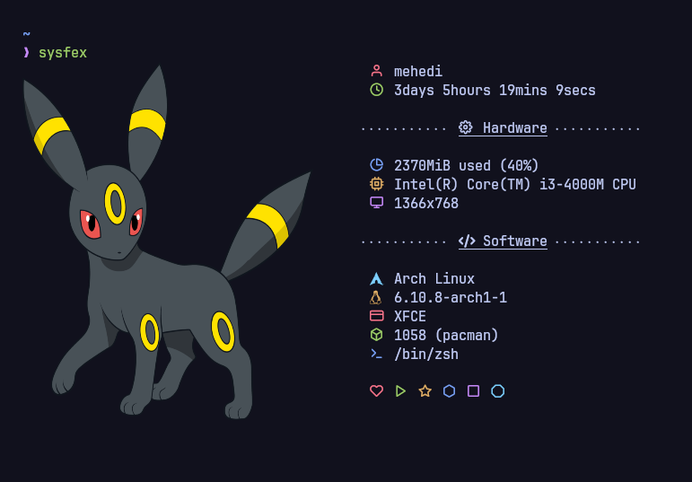

# Sysfex
Sysfex is just another system information fetching tool for <b>Linux-based systems</b>, written in C++
<p align="center"></p>

## Key Features
- Print ASCII and information side by side, or one after another
- Render image in place of ASCII using [viu](https://github.com/atanunq/viu)
- Customize output without recompiling through dedicated configuration files
- Output supports customized colors and text decorations (bold, italic or underline)
- Easily extensible

## Install

Required for Sysfex to work properly:
- `libx11` (or `libx11-dev`) : for getting screen resolution on Xorg (TODO: add workaround for Wayland)
- `viu` (optional) : backend for rendering image


### Cloning and compiling

Clone Sysfex using `git`:
```
git clone https://github.com/mehedirm6244/sysfex && cd sysfex
```

Compile Sysfex using `cmake`:
```
mkdir build && cd build
cmake ..
cmake --build . -j 4
```

Now you can try Sysfex without installing it to the system
```
./sysfex
```

### Installing Sysfex to system

Make sure that your present working directory is `sysfex`
```
cd ..
```
Copy files to proper directories:
```
sudo cp build/sysfex /usr/bin
sudo chown ${USER} /usr/bin/sysfex
```

## Uninstall

Remove Sysfex from system:
```
sudo rm /usr/bin/sysfex
```

## Configuration

**No configuration file is generated by default, so you'll most likely be greeted with an error.**

A sample set of configuration can be found in `/examples`. Copy the files to `~/.config/sysfex` and tweak them according to your needs.


The configuration for Sysfex is split into two files
| File name | Description |
| ----------|-------------|
| ``config`` | Stores instructions on how to print stuffs, such as: gaps, character used in color blocks, separator character, which ascii to print etc.
| ``info`` | Stores instructions on what to be printed, such as: model name, screen resolution, kernel version etc. |

## Usage

Use `sysfex --help` for listing all valid flags


## To Do
- [ ] Add support for Wayland
- [ ] Rewrite configuration file handling method
- [ ] Write detailed documentation

## Special thanks to

* Some cool fetch tools spread all over GitHub for inspiration and ideas.
* [nothings/stb](https://github.com/nothings/stb) for a nice image processing library
* The contributors, testers and those who gave me ideas as well as helped this project spread
* You, for being interested in this project
