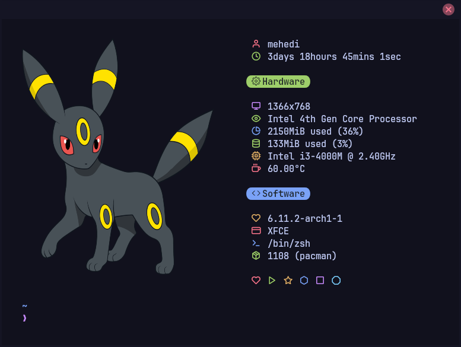
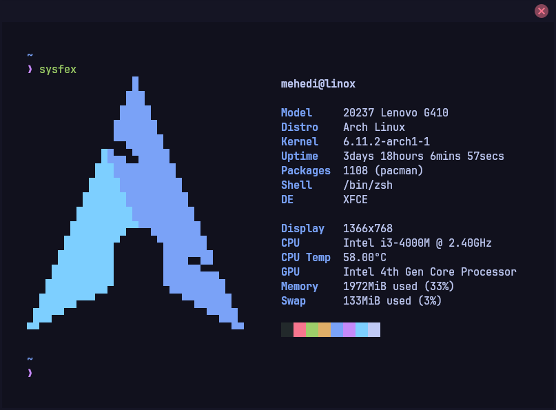
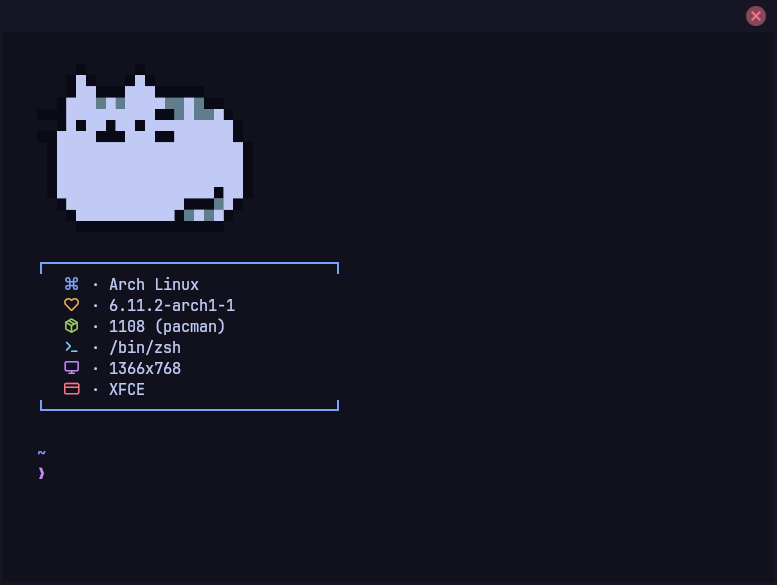

# Sysfex
**Sysfex** is a command-line system information fetching tool for *Linux-based systems*, written in `C++`. It displays information about your operating system, software and hardware in an aesthetic and visually pleasing way.
<p align="center"></p>

## Key Features
- Print information beside or after ASCII
- Use image instead of ASCII using [viu](https://github.com/atanunq/viu)
- Customize output without recompiling `sysfex` through dedicated configuration files
- Easily extensible and understandable

## Install

### Dependencies

- `viu` (optional) : backend for rendering image


### Cloning and compiling

Clone Sysfex using `git`:
```
git clone https://github.com/mehedirm6244/sysfex
cd sysfex
```

Compile Sysfex using `cmake`:
```
mkdir build && cd build
cmake ..
cmake --build .
```

You can now try Sysfex without installing it to the system
```
./sysfex
```

### Installing Sysfex to system

Copy `sysfex` binary to `/usr/bin`:
```
sudo cp sysfex /usr/bin
```

## Uninstall

Remove `sysfex` binary from `/usr/bin`:
```
sudo rm /usr/bin/sysfex
```

## Gallery
Configurations for the following can be found in `/examples`

### Default
<p align="center"></p>

### Cool
Icon font: Feather
<p align="center"></p>

### Catto
Icon font: Feather
<p align="center"></p>

## Configuration

Sysfex automatically generates configuration files on the first run in `~/.config/sysfex`. Some sample set of configurations can also be found in the `/examples` folder of this project for better understanding.


The configuration for Sysfex is split into two files
| File name | Description |
| ----------|-------------|
| config | Stores instructions on how information will be printed
| info | Stores instructions on what information will be printed |

## Usage

Run `sysfex --help` for usage


## Thanks to

* Some cool fetch tools spread all over GitHub for inspiration and ideas.
* [nothings/stb](https://github.com/nothings/stb) for the image processing library
* The contributors, testers and those who gave me ideas as well as helped this project spread
* You, for having interest in this project
